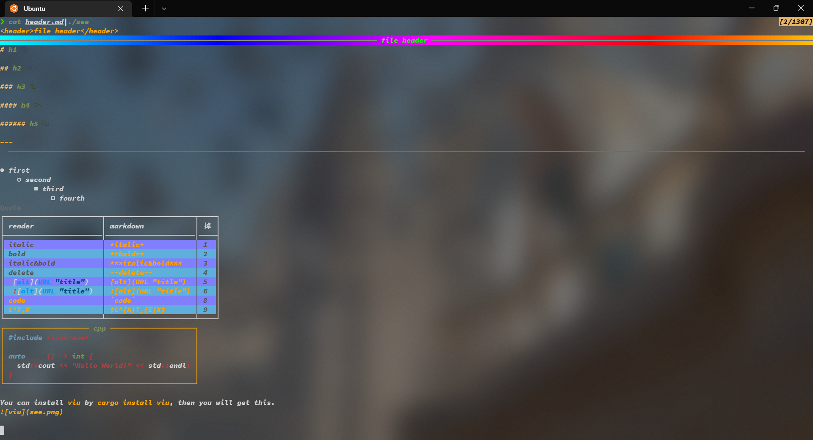
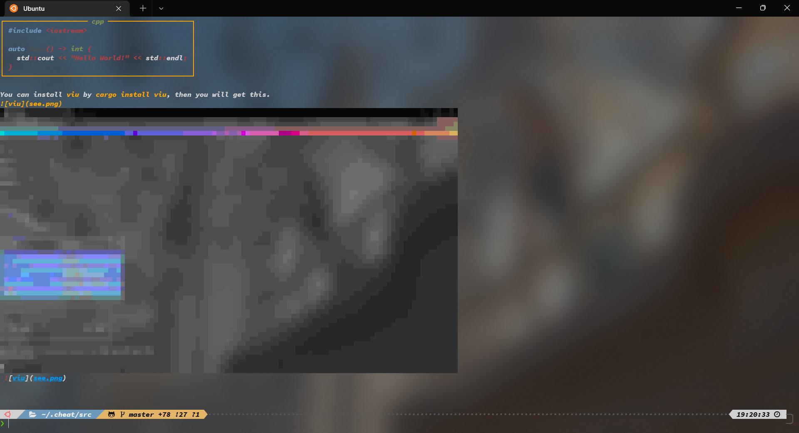

# Markdown2Ansi




## Usage

```sh
cat markdown.md | see
```

## Install

```sh
git clone --depth=1 https://github.com/mrbeardad/Markdown2Ansi
mkdir Markdown2Ansi/build
cd Markdown2Ansi/build
cmake -DCMAKE_BUILD_TYPE=Release ..
cmake --build . -t see
mv see ~/.local/bin
```
